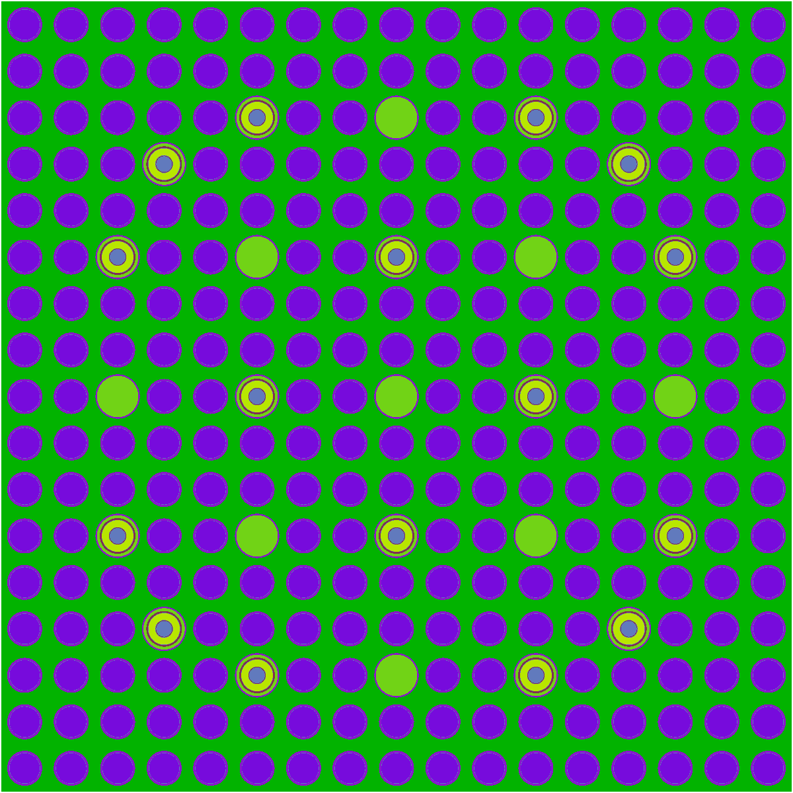
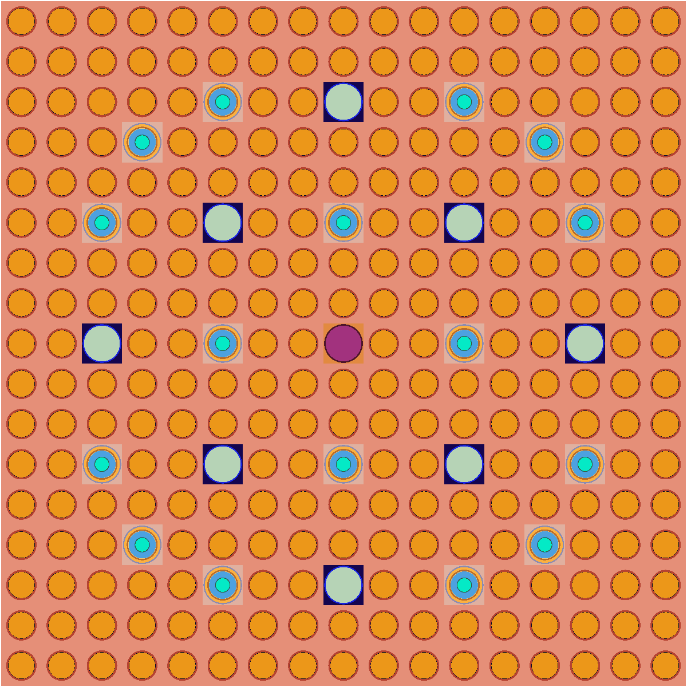

# OpenMC-Agent 技术总结报告

> 从自然语言反应堆建模需求到可信 OpenMC 模型的受控 Agent 系统

- 汇报人：伍宾达
- 单位：清华大学工程物理系
- 日期：2026 年 7 月

<!-- 由对应 TeX 源转换；TikZ 图保留图题，现有位图保留为相对链接。 -->

## 摘 要

OpenMC-Agent 面向"以自然语言描述核工程建模需求"的工程场景。系统将大语言模型约束为**结构化建模决策器**：LLM 提议计划、诊断语义冲突、在受限 allowlist 内提出补丁；事实检查、提交与执行的权力留给 Pydantic 校验器、确定性策略、本地 renderer 与 OpenMC 工具。系统以 ``SimulationPlan`` / ``ComplexModelSpec`` 强类型中间表示（IR）为核心，由 LangGraph 编排两个智能闭环——Plan 闭环处理"生成什么、能否进入建模流水线"，Runtime 闭环处理"实际执行失败后是否存在可证明安全的局部恢复"。两个闭环共享同一控制面：稳定 issue taxonomy、行动预算、fingerprint 防回归与 ``fail-closed`` 终止语义。

报告覆盖技术路线、技术栈、Agent 工作流、增量 Plan Builder、检索增强、状态管理、可信性边界与验证体系，重点为 Phase 8C 的五 Gate 闭环、带 hash 的 checkpoint/replay 与受控恢复机制。截至 2026-07-26，非 OpenMC/非 LLM 全量回归为 **3715 passed, 2 skipped, 392 deselected**，fake workflow benchmark 21/21 通过；Material-Universe Gate 已完成 target-only live-review 验收，Placement 真实 canary 已越过 Facts/MU 并到达 Placement reviewer。这些结果支持工程闭环的可信基础，但 LLM 生成模型的 $k_eff$ 与确定性 gold model 仍存在偏差，需要独立的物理 benchmark 验收。

**关键词：** OpenMC；Agentic AI；结构化中间表示；Pydantic；LangGraph；增量 Plan Builder；运行期恢复；可信执行

> **一句话核心命题**

> OpenMC-Agent 用结构化状态与确定性策略，把 LLM 在核工程任务中的自由度约束在**可审查、可恢复、可拒绝**的范围内。

## 引言：为何不能让 LLM 直接生成并运行核工程代码

### 问题背景

反应堆建模需求天然耦合多种约束：材料组分与密度、几何尺寸与坐标、栅格装载图、边界条件、源项与运行设置。这些约束既不能由自然语言完整表达，也不能由模型在缺失时随意补齐。材料密度、核数据库路径、真实装载图与 benchmark 常数属于**核工程事实**，必须显式来源；如果让 LLM 在自由文本中臆测这些数值，错误会同时混入语法层、语义层与物理层，难以定位与归因。

更隐蔽的风险在于：*Python 代码可运行*并不蕴含*物理模型可信*。一段能够通过 OpenMC 解析、产生 $k_eff$ 数值的代码，仍可能在材料组成、几何对齐或边界条件上偏离需求。直接让 LLM 输出可执行代码，会把"代码能跑"和"物理正确"两件本应分开验收的事情合并成一次不可审查的赌博。

### 研究目标

OpenMC-Agent 把目标从"让模型写代码"改为"让模型产出可审查、可拒绝、可恢复的**结构化建模决策**"。系统的四条目标约束如下：

- LLM 输出限定为 JSON-only 的强类型 IR，每一步都是可被本地代码校验的有限动作；

- "事实缺失"进入 ``requires_human_confirmation`` 状态，LLM 不得通过检索或 few-shot 把文档片段补齐为事实；

- "执行失败"按可确定性修复、需人工事实、环境问题、瞬态错误、未知类别分流，避免盲目重生成；

- 每次接受都记录为带 hash 的脱敏 checkpoint，恢复过程因此可验证、可复现、可拒绝。

> **设计分析：从问题到可验证处理**

> **问题**：自由文本代码生成把事实不确定性、程序错误与物理错误叠加在同一输出上，难以归因。
> **机制**：把 LLM 的作用压缩为结构化 IR 提议；行动被拆成"生成 → 审计 → 受限修复 → 受控路由"。
> **为何可信**：缺失材料、核数据路径、真实装载图等事实必须显式进入人工确认，不由检索或 few-shot 补齐。
> **示例**：当需求给出"有限轴向高度存在的插入件"而 IR 仍按全高度处理时，3D guard 在渲染前就产生结构化 issue，把候选降级为 skeleton 而不是错误地继续渲染。

## 总体技术路线：三平面架构与统一控制面

> **图：** 三平面架构：需求与证据、Plan 智能闭环、Runtime 智能闭环共享统一控制面。

三平面架构避免把所有问题交给同一次 LLM 调用。**需求与证据平面**只负责从自然语言、本地 OpenMC API、检索证据与 few-shot 中提取输入；**Plan 智能闭环**决定结构化模型能否被组装并通过 Gate；**Runtime 智能闭环**面对真实 OpenMC 工具反馈。贯穿三个平面的是**统一控制面**：强类型契约、稳定 issue taxonomy、可审计 artifact、行动预算与人工确认机制。

这一分工遵循 Agentic AI 的一项基本工程原则：模型负责需要语义判断的窄动作（提议、审查、诊断、受限 patch），本地工具负责可重复、可验证、会造成外部副作用的动作（schema 校验、capability 重算、renderer 调用、OpenMC 执行）。

### 职责边界

**表：** LLM、本地代码与人的职责划分。

| 角色 | 可承担的职责 |
| --- | --- |
| LLM | 结构化建模决策、只读语义审计、在 allowlist 内的受限 patch 提议、从 Python 预计算的 ``allowed_actions`` 中选择动作。LLM 不能直接写 renderer/XML，不能直接调用 OpenMC，不能自动改写材料组成、密度、几何坐标、核数据或真实装载图。 |
| 本地确定性系统 | schema/policy 校验、capability 重算、renderer/OpenMC 执行、candidate 评估、veto 与预算控制、checkpoint 完整性检查、fail-closed 终止。本地代码拥有对系统状态修改的最终决定权。 |
| 人 | 缺失材料事实、核数据库路径、真实装载图、物理含义歧义、benchmark 常数的最终授权。所有这些必须通过结构化的 ``human_confirmation`` 进入系统，而非由模型猜测。 |

### 技术栈

**表：** 五层工程化分工、代表技术与不可替代职责。

| 层次 | 代表技术与版本 | 不可替代职责 |
| --- | --- | --- |
| 模型契约 | Python 3.10、Pydantic v2、``pydantic-json-schema`` | 定义 ``SimulationPlan``、patch、issue、state；强类型校验、JSON 可序列化、JSON Schema 暴露给 LLM 结构化输出。 |
| Agent 编排 | LangGraph、aisuite、httpx | 状态图节点与边、条件路由、结构化 LLM 调用、超时/重试、人工 interrupt/resume、checkpoint 持久化。 |
| 检索增强 | ripgrep（``grep_search.py``）、自建知识图谱、``graphrag_query_planner``、``graphrag_retriever``、``evidence_ranker`` | 按 ``ValidationIssue`` 提供受限上下文，去重排序并控制 prompt budget；不确认物理事实。 |
| 建模执行 | OpenMC 0.15.x、``renderers/``（PinCell / Assembly / Core / TRISO）、``renderer_authoring/`` | 确定性渲染 Python 模型、导出 XML、几何绘图（``openmc -p``）、低粒子 smoke test。 |
| 验证评估 | pytest（数千条）、``workflow_trace.py``、``benchmark_runner.py``、``real_campaign_harness.py`` | 分层回归、过程观测、benchmark、真实 LLM+OpenMC 端到端 campaign。 |

每一层选型都遵循同一原则——把**可被确定性验证的部分**留在本地工具链，把**需要语义判断的部分**交给 LLM。Pydantic 同时承担"契约定义"和"结构化输出约束"双重角色，使 LLM 的输出空间在调用前就被收紧到有限动作集。

### LangGraph 在系统中的作用

LangGraph 在本系统中不只是"调用 LLM 的胶水"，而是承担**状态机编排器**的角色。它的几项原生能力被映射到具体的工程契约：

- **StateGraph + TypedDict state**——每个图节点的输入/输出都由强类型 state 字典约束；本项目的 ``PlanBuildState`` 就是 LangGraph state 的扩展超集，把 requirement、patch envelopes、issues、repair ledger、预算与 retry ledger 编织进同一可序列化对象。

- **条件边（conditional_edges）**——实现 P0-A/P0-B/P0-C 三节点之间的受控路由，以及 Runtime 中 deterministic-repair vs LLM-diagnosis vs human-confirmation 的分流。每条边的谓词由 Python 函数实现，LLM 不能直接改写路由。

- **interrupt/resume**——为人工确认提供原生入口：当 finding 标记 ``requires_human_confirmation`` 时，图暂停并把结构化问题抛给操作者；恢复后从同一节点继续，state 不丢。

- **checkpoint 持久化**——LangGraph 的 checkpointer 接口被本项目扩展为带 hash 校验的 ``campaign_checkpoint.py``，支持 ``resume`` 与 target-only replay。

- **结构化 LLM 调用**——通过 aisuite + httpx + Pydantic 完成 JSON-only 输出、超时/重试与 provider 多路由（OpenAI 兼容接口、glm 等）。

**为什么选 LangGraph 而不是更轻量的 agent 框架？** 关键理由有三：第一，整个工作流是*状态化*而非消息流——每一步都要基于完整 ``PlanBuildState`` 决策，而非追加 chat history；第二，工作流需要*可中断与可恢复*（人工确认、checkpoint replay），LangGraph 的 interrupt 与 checkpointer 直接覆盖；第三，路由需要*可静态分析*——条件边的谓词是 Python 函数，可作为策略合约被审计。

### 项目主要文件树

项目按"模块族"组织，每个族对应报告中的一章。下表列出关键文件与本章对应关系（``tests/`` 443 个测试文件、``scripts/`` 27 个脚本与 ``docs/`` 65 篇策略文档未全列）：

> **图：** 项目主要文件树（标注 ``[Ch.N]`` 表示该模块主要在第 N 章描述）。

### 端到端工作流：覆盖后续各章的路由图

该路由图把后续 3--8 章的关键模块串成单张路由图，标注每一步对应的章节，可作为阅读后续章节时的"导航图"。蓝色节点表示 Plan 闭环（第 3--6 章），绿色节点表示 Runtime 闭环（第 7 章），琥珀色表示可观测性与验证（第 8 章）。

> **图：** 端到端工作流路由图（按 ``graph.py`` 实际连线）：准备 → Plan 生成（五 Gate 在 ``generate_plan`` 内部）→ Plan 校验（P0-A/B/C 在生成完成后）→ Runtime → 观测。

这张路由图揭示了三条贯穿性的设计意图：第一，**LLM 节点都在主数据流上，但不掌握提交权**——每个 LLM 节点（IR、audit、patch、supervisor、diagnosis）之后都跟着确定性校验；第二，**检索与状态都是旁路**——检索只向 LLM 提供上下文（虚线进入 patch/audit），``PlanBuildState`` 只向 assembler 提供已接受边界，两者都不直接产生 ``SimulationPlan`` 字段；第三，**trace 与 evaluation 独立于主流程**——它们记录与评估，但不改变路由。

## Plan 阶段：从需求到可审查结构化模型

> **图：** Plan 阶段端到端路径；五 Gate 在 LLM 结构化 IR 与 Pydantic 校验之间增量执行（详见图 7），失败被引导到局部、可审计的恢复分支。

考虑一个会反复出现的建模情形：需求明确某局部插入件只在有限轴向高度出现，但初始计划可能把它当作贯穿整个基础 lattice 的默认结构。这一情形与具体堆型无关，本质上属于"输入语义与组合后结构不一致"的问题，因此可作为本章后续讨论的锚点。

> **贯穿案例：有限轴向插入件与基础 lattice 冲突**

> **场景**：需求给出"有限高度存在"的语义，初始 patch/assembled plan 可能把它放入全高度基础结构。
> **关键问题**：字段单独看都可能合格，怎样发现跨 patch、跨几何层级的冲突，并且只修复真正需要修复的局部？
> **系统不应做什么**：不能凭空猜测精确高度，不能因为发现冲突就全量重写模型，更不能顺带修改材料、坐标或真实装载事实。

### 结构化 IR 与渲染能力分级

``SimulationPlan`` 与 ``ComplexModelSpec`` 把材料、几何、lattice、轴向 overlay、settings、capability report 与待确认项变成强类型对象。LLM 输出首先被 normalizer 修正可机械识别的矛盾字段，再进入 Pydantic 校验；本地 capability assessment 独立重算 renderer 能力，不接受 LLM 的自报。

输出按可执行性分为四级：none（仅有 IR）、skeleton（可审查骨架 + TODO）、exportable（可导出 XML）、runnable（可执行 + smoke test）。信息不完整时，系统降级为 skeleton 或请求人工确认，不产生"形式可运行、物理错误"的模型。"不知道"由此成为系统的合法输出状态，而非隐藏在自由文本中的不确定性。

### Plan LLM 智能闭环：反思不是无约束再生成

> **图：** Plan 闭环把 LLM 的反思、修复与路由选择拆成三个受控节点。

Plan 闭环把传统 Agent 的"reflection"动作拆成三个独立、可验证的子节点。**P0-A 语义审计**是只读操作，识别轴向、材料、几何与边界之间的冲突，但不写入计划。**P0-B 修复提议**仅在确定性 allowlist 内提出 RFC6902 patch，每条 operation 都会被本地代码检查操作类型、JSON Pointer、是否触及 protected path。**P0-C 路由监督**只能从 Python 预先计算的 ``allowed_actions`` 中选择，选择结果仍受 veto、循环检测、预算与确定性回退的约束。

将"反思、行动选择、工具使用"从一次自由生成拆为可验证的结构化子动作，是这一闭环在 Agentic AI 层面的核心思路：行动空间、权限与提交条件由确定性策略预先定义，LLM 只在限定范围内提供判断。

### 闭环的数据契约

> **图：** Plan 闭环每一步都有固定输入、固定输出与唯一提交门。

闭环的起点是*已经可被本地检查的计划状态*，而非自然语言原文。P0-A 接收需求摘要、检索证据、patch 摘要、assembled plan、validation/capability/material summary，输出 ``SemanticAuditFinding``——包含 finding code、severity、evidence、target patch、是否需要人工确认与 confidence。该输出把语义判断转换为后续策略可消费的数据契约。

P0-B 的输入不是"请修好模型"，而是 validation issue 与 audit finding 对应的 issue code、计划摘要与适用的路径规则。它输出 RFC6902 operations 及其来源 issue；每个 operation 都被确定性代码独立检查。任何不合规操作都会使候选整体标为 unsafe，而不会部分应用——这是唯一提交门的第一道防线。

P0-C 输入当前 stage、schema/blocking/warning issues、patch status、semantic findings、repair decision、renderability、human gap、``allowed_actions``、retry budget、recent actions 与 state fingerprint。它返回一个 proposed decision，但**这只是建议**：是否成为 ``final_action`` 仍由 Python 的 veto、loop detection、budget 与 fallback 决定。

### 唯一提交门：为何 clone、验证与改善判定缺一不可

Plan 闭环的真正闭合点不在三个 LLM 节点之间，而在唯一提交门。该门由以下五条规则组成：第一，**clone-only**——JSON Patch 先应用到深拷贝，任何操作失败即无候选，正式计划不会留下半修改状态；第二，**前后对比**——修复前后都运行 schema 与 plan validation，候选必须保持 schema 合法；第三，**目标改善**——引发修复的 source issue/finding 不能原样保留；第四，**不引入新阻塞**——候选新增 blocking issue 或增加阻塞数量即被拒绝；第五，**状态闭合**——接受的候选写入 repair ledger 与下游 Gate，被拒绝的候选保留原因供 fallback、人工确认或停止使用。

### 案例一：语义不一致如何变成可审计的局部修复

回到贯穿案例。validator 把 assembled-plan 问题映射到负责的 patch；LLM 仅对该 patch 提出受 allowlist 约束的 JSON Patch；系统在 clone 上完成 patch、assembly 与 full-plan validation。只有候选改善且未触及 protected path 才能提交，否则系统记录 issue 并请求人工确认或终止。如果精确轴向范围本身未在输入中给出，系统不会猜测数值：P0-C 应选择 ``request_human_confirmation`` 或 ``stop``，而不是把检索文本当成物理事实。

### 实现方法

Plan 阶段的核心数据契约由 Pydantic v2 定义：``SimulationPlan`` / ``ComplexModelSpec`` 描述材料、几何、lattice、轴向 overlay 与 settings；``SemanticAuditFinding`` 把语义判断编码为 ``finding_code``、``severity``、``evidence``、``suggested_patch_target``、``requires_human_confirmation`` 与 ``confidence`` 等可序列化字段。LLM 调用通过 LangGraph 节点 + aisuite + httpx 完成，统一使用 JSON-only 结构化输出与超时/重试控制。

校验链分为三层：**normalizer** 先修正可机械识别的矛盾字段（如空 ``operating_state`` canonicalize 为 ``base``），**Pydantic 校验**再拒绝不合格 schema，最后**capability assessment** 独立重算 renderer 能力，不相信 LLM 的自报。修复候选以 RFC6902 JSON Patch 表达，逐操作经 allowlist 校验后应用到 Python 深拷贝（``copy.deepcopy``）上做原子 patch + assembly + full-plan validation。代表实现位于 ``semantic_audit.py``、``run_supervisor.py``、``repair_proposal.py``、``auto_repair.py`` 与 ``plan_builder/closed_loop/``。

## 增量 Plan Builder 与五 Gate

> **图：** Patch 依赖与五 Gate：从局部事实到 assembled plan 的分层收敛。

对于复杂三维、多 variant 或大 lattice 情形，单体 ``SimulationPlan`` 把输出长度、依赖关系与定位成本叠加在同一上下文，JSON 稳定性差。增量 Plan Builder 把 ``facts``、``materials``、``universes``、``pin_map``、``axial_overlays``、``settings`` 与 ``core_layout`` 拆成 patch。每个 patch 是可重试、可归因、可替换的子目标；局部 schema 校验后由确定性 assembler 组合成完整计划；重复几何与默认结构不由 LLM 大段展开。

**表：** 层级 patch 的主要内容与控制点。

| 层级 patch | 主要内容 | 控制点 |
| --- | --- | --- |
| facts | 需求事实、范围、未确认项 | 证据覆盖与人工确认边界。 |
| materials / universes | 材料、单元与宇宙结构 | 组成、variant binding、局部 schema 与交叉一致性。 |
| pin_map | 特殊坐标与装载差异 | 只描述差异项，由 assembler 确定性展开。 |
| axial_layers / overlays | 轴向分层与覆盖 | 3D guard、through-path、几何与材料约束。 |
| settings | 边界、source、运行设置 | 根据几何及能力契约进行一致性检查。 |

五 Gate 依次审查事实（Facts）、材料-universe 绑定（Material-Universe）、布置契约（Placement）、轴向几何（Axial Geometry）与最终组装（Assembled Plan）。每个 Gate 都包含 preflight、evidence、review 与 repair ledger 四个动作；未达可信 accepted 时，系统走受控 repair/retry/human 或 fail-closed，不越过 barrier。

为保持反应堆类型无关，材料、几何、栅格与边界由输入文档及结构化字段驱动；prompt、validator 与 renderer 不写死某一堆型规则。Placement 发现 profile/universe 引用未被上游满足时，只产生结构化的 owner/dependency 请求，不会把"PWR 应该这样布局"之类的规则写死在修复器中。

### 实现方法

增量 Plan Builder 把模型分解为若干 patch 类型：``facts``、``materials``、``universes``、``pin_map``、``axial_layers`` / ``axial_overlays``、``settings``、``core_layout``。每个 patch 是独立可重试、可归因、可替换的子目标，由确定性 assembler（``plan_builder/assembler.py``）按 ``dependency_graph.py`` 描述的偏序关系组合成完整 ``SimulationPlan``，重复几何与默认结构不由 LLM 展开。

五 Gate 的每一道都遵循统一的"preflight $→$ evidence $→$ reviewer $→$ repair ledger"协议：preflight 在 ``closed_loop/<gate>_preflight.py`` 中执行确定性检查（材料-universe binding、localized insert profile、fuel variant reachability、core layout evidence coverage 等）；evidence pack 在 ``<gate>_evidence.py`` 中聚合 accepted Facts/MU 边界与 contract rows；reviewer 在 ``<gate>_reviewer.py`` 中以 LangGraph 节点形式调用 LLM 做语义审查。Gate finding 用稳定 issue code 标识（如 ``material_universe.fuel_variant_material_mismatch``），并写入 ``PlanBuildState`` 的 repair ledger 供下游使用。

## 检索与知识增强：提供上下文，而非制造事实

> **图：** Issue 驱动检索与软/硬证据边界。

检索编排以 validation issue 为入口，依次执行 grep 精确定位、图关系扩展、GraphRAG/RAG 召回、证据合并与排序。Evidence Ranker 对 locator、chunk 与近重复文本去重，按 issue、schema、concept、API 与图路径相关性排序，并控制每类数量与 prompt 字符预算。其目标是让诊断获得必要的接口与 schema 上下文；文档片段不会被自动升级为模型事实。

> **设计分析：检索在闭环中的位置**

> **问题**：复杂工程仓库的相关知识分散，直接塞入全部文档会降低模型判断质量。
> **机制**：retrieval-augmented deliberation——依据当前 issue 动态选择少量、可定位的上下文。
> **为何可信**：RAG/GraphRAG 不得确认密度、composition、核数据库路径、真实 loading map 或 benchmark 常数。
> **示例**：当 issue 是 API 调用签名不匹配时，可检索本地 API 语义辅助修复；当 issue 是材料密度缺失时，即便文档中出现看似相关数值，系统也必须保留 ``requires_human_confirmation``。前者是上下文问题，后者是事实授权问题。

> **图：** 检索结果先经过问题分类与证据治理，最终只能作为受限的审计/诊断上下文。

检索并非"发现了文本就写入模型"。系统先依据当前 issue 判定检索意图——例如 API/schema 修复、结构关系核对、事实缺口或 runtime diagnosis——再由 grep、图关系和 RAG/GraphRAG 定位候选证据。merge/rank 阶段负责 locator/chunk 去重、关联性排序与 prompt budget 截断，减少无关上下文把模型引向错误结论。

### 实现方法

检索链以 ``ValidationIssue`` 为入口，由 ``retrieval_orchestrator.py`` 编排为四级流水线：（1）``grep_search.py`` 调用 ripgrep 做精确定位（locator-aware，按文件名、行号、JSON Pointer 索引）；（2）``knowledge_graph.py`` + ``knowledge_graph_registry.py`` 做关系扩展（cell $→$ universe $→$ material $→$ lattice 等结构关系）；（3）``graphrag_query_planner.py`` 识别 intent（schema repair / runtime diagnosis / fact gap）并生成查询计划，``graphrag_retriever.py`` 执行召回；（4）``evidence_ranker.py`` 对候选证据做去重、相关性排序与 prompt budget 控制。

知识 ingestion 在 ``knowledge_ingestion.py`` 中完成（API 签名提取、schema 语义标注、文档分段），运行时加载由 ``knowledge_runtime.py`` 负责。ranker 的相关性函数综合 issue code、schema 概念、API 路径与图路径距离，并按类别（API/schema/concept/runtime）分别限额，确保进入 prompt 的证据量受字符预算约束。整个检索链不写入 ``SimulationPlan``——它的输出只作为审计与诊断的辅助上下文。

## 状态管理与可恢复闭环

> **图：** PlanBuildState 以 hash 绑定已接受边界，replay 只复用可证明相同的状态。

``PlanBuildState`` 不是普通日志：它保存 requirement、任务列表、patch envelope、assembled plan、issues、events、repair history、候选 hash、预算、retry ledger 与人机问答。它是工作流的行为契约，定义什么能被重试、什么已被接受、什么必须升级给人。

### Checkpoint 与 Replay

checkpoint 把已接受边界按 input、evidence、inventory、structured-output policy 与 canonical hash 脱敏固化。replay 只在所有 fingerprint 一致时才调用目标 Gate 的生产 preflight/evidence/reviewer 路径。任何 hash 漂移、快照损坏或敏感字段（raw prompt、reasoning、token、secret）出现都会触发拒绝复用，避免旧证据被错误迁移到新输入。

### 状态机与恢复协议

> **图：** Gate 从 pending 到 accepted 的状态变化；只有 accepted boundary 才能成为 checkpoint。

每个 Gate 的状态至少区分 pending、validating、reviewing、repairing、accepted 与 blocked。状态变化携带对应 finding、证据、patch、预算与事件。target replay 与"从旧聊天记录继续说"有本质区别：它仅在所有 fingerprint 一致时调用目标 Gate 的 production preflight、evidence 与 reviewer path。

### 案例二：从局部构建到 Gate 恢复

当下游 placement preflight 暴露缺失引用时，系统保留已接受的 Facts/MU 边界、issue 与证据 hash；只对目标 Gate 及其被授权的 owner 进行 replay 或 retry。恢复的正确性不来自"上次模型看起来回答过"，而来自输入、证据、库存与策略 hash 均未漂移。若任一条件不满足，系统拒绝复用并回到受控路径。

### 实现方法

``PlanBuildState``（``plan_builder/state.py``）是 JSON 可序列化的外部状态容器，保存 requirement、component tasks、patch envelopes、assembled plan、validation issues、build events、repair history、candidate hash、retry ledger 与人机问答；它定义了"什么能被重试、什么已被接受、什么必须升级给人"的行为契约。

checkpoint 与 replay 的实现围绕**多源 hash 绑定**展开：``campaign_checkpoint.py`` 对每个 accepted boundary 计算 input hash、evidence hash、inventory hash、structured-output policy hash 与 canonical hashes（均基于 SHA-256 over canonical JSON）。原子写入由专用 JSON store 完成——写入失败或并发访问时整体回滚，不会留下半写入状态。``GateReplayBundle`` 在 ``closed_loop/`` 中只调用目标 Gate 的生产 preflight/evidence/reviewer 路径，不重放 provider 原始输出。

sanitization 阶段剔除 raw prompt、reasoning、token、secret 等敏感字段；hydrate 阶段先校验 ``state_hash`` 与各 fingerprint，再重建 ledger 与 index；任何漂移、损坏或敏感字段出现都会 fail-closed，触发重新进入受控构建流程。

> **memory 的工程化解释**

> agent memory 被实现为可验证状态，而不是可任意引用的历史对话。Replay 复用的是**已接受边界**，而非全部对话上下文。

## Runtime 阶段：执行失败不能触发全量重生成

本章围绕第二个贯穿案例展开：一个已通过前序结构检查的候选，在真实工具执行中因 source/settings 配置产生失败。问题焦点在于怎样保留已验证结构，只对可证明的故障边界做最小处理——而非让 LLM 重新写一个模型。

> **贯穿案例：source/settings 执行故障**

> **场景**：已组装计划进入 renderer/OpenMC 后出现受控 source 相关失败；失败信息来自实际工具而不是自然语言猜测。
> **关键问题**：这是设置问题、事实缺失、环境问题还是物理歧义？若可修复，谁有权修改、如何证明候选比原计划更好？
> **系统不应做什么**：不能把环境故障伪装成模型修复；不能用 LLM 自动填写材料、几何或物理常数；不能在无改善时无限重试。

> **图：** Runtime 的第一原则：先分类与归因，再判断是否存在安全的确定性修复。

执行失败可能源于 OpenMC 输入、renderer 输出、环境、路径、source/settings 或几何。直接调用 LLM 重建整个模型会破坏已经通过 Gate 的局部结构，也会使运行期错误与需求理解错误混淆。因此 ``RuntimeFailure`` 被归类为可确定性修复、需人工事实、环境、瞬态或未知等类别，并按 failure fingerprint 防止重复尝试。

### Runtime 决策树：LLM 不是默认修复器

> **图：** Runtime 先走确定性分类；LLM 仅在"无确定性修复且 policy 明确允许"时进入候选通道。

``RuntimeFailure`` 的最小可审计表示包括工具阶段、主/次问题、稳定 fingerprint、已渲染对象映射、日志摘要与已有修复历史。确定性 policy 先区分 plan-fixable、human fact、environment、transient 与 unknown。已有安全修复策略的错误走 deterministic repair；涉及事实、物理歧义或环境的错误分别进入 human、环境处理或 stop，而**不**调用 LLM 进行"猜测式修复"。

只有在没有确定性修复且策略允许时，runtime diagnostician 才看到最小证据包并给出结构化诊断；patch proposer 才能在 clone-only 约束下提出候选。候选仍需经过 isolated render、XML/debug、policy 与必要的 smoke 检查——LLM 的参与并不缩短验证链，也不扩大可修改事实的范围。

### Runtime LLM 智能闭环：候选生成器，不是执行者

> **图：** Runtime LLM 回路：最小证据包、结构化诊断、受限 patch、clone 评估与有界重执行。

在没有确定性修复、且策略允许时，runtime diagnostician 只接收最小证据包并输出 ``RuntimeDiagnosis``；runtime patch proposer 只产生受约束的 RFC6902 patch。候选必须通过 schema、runtime policy、isolated render、XML/debug 与必要的 smoke test 后才可提交。LLM 在此路径中扮演候选生成器，而非修改系统状态的执行者。

### 案例三：source 故障的端到端受控恢复

项目的 T4 场景用受控 source fault 验证真实 OpenMC 失败与确定性修复链路：先由 preflight 拦截/诊断，再修复 settings，候选评估通过真实 smoke test 后才重执行。该案例证明的是**特定运行期恢复链**，而不是材料或几何物理保真度，也不把 fake diagnosis/proposal 计入真实 LLM 证据。若候选无改善则停止，而非不断生成——这是 Runtime supervisor 的停止语义。

### Runtime Supervisor：智能循环必须有停止条件

> **图：** Supervisor 只建议合法动作，Python 依据 veto、预算与指纹给出最终 disposition。

Runtime supervisor 的 action 集包括成功结束、尝试确定性修复、尝试 LLM 修复、同计划重试、请求人工确认与停止。它与 Plan supervisor 分离，因为二者拥有不同的权限与预算。默认预算限制 runtime iterations、已提交修复、重执行、LLM 诊断/提案、candidate OpenMC checks、瞬态重试与无进展步骤。同一 primary fingerprint 在提交后重现、预算耗尽或无进展都会 ``fail-closed``。

> **fail-closed 是可信自治的终止语义**

> 没有停止语义的 agent loop 会无限重试，既浪费资源又可能掩盖事实缺口。fail-closed 在此系统中作为可信自治的终止语义存在，而非异常处理的缺省分支。

### 实现方法

Runtime 阶段的核心数据契约是 ``RuntimeFailure``（``runtime_faults.py``）：它把 OpenMC / renderer 的执行反馈编码为工具阶段、主/次问题、稳定 fingerprint、已渲染对象映射、日志摘要与已有修复历史。fingerprint 由 issue code + 受影响 path + failure class 计算得出，用于检测"同一故障在提交后重现"。

失败分类与候选评估由几个协作模块完成：``repair_policy.py`` 给出确定性分类（plan-fixable / human fact / environment / transient / unknown）与 allowlist 规则；``runtime_diagnostician.py`` 在策略允许时只接收最小证据包，输出结构化 ``RuntimeDiagnosis``；``repair_proposal.py`` 在 clone-only 约束下生成受限 RFC6902 patch；候选必须依次通过 schema、runtime policy、isolated render（独立 ``GeometryComponentInventory``）、XML/debug 检查与必要时的真实 OpenMC smoke test。

``runtime_supervisor.py`` 实现 bounded autonomy：默认预算为 4 次 runtime iteration、3 次 committed repair / reexecution、2 次 LLM diagnosis / proposal、4 次 candidate OpenMC checks、2 次 no-progress 容忍；同一 primary fingerprint 在提交后重现默认 0 次容忍。supervisor 的 ``allowed_actions`` 由 Python 预先计算，LLM 仅从中选择，最终 ``final_action`` 仍受 veto、loop detection、budget 与 fallback 约束。代表实现还包括 ``p1_runtime_gate.py``、``runtime_campaign.py`` 与 ``runtime_feedback.py``。

## 可观测性、验证体系与证据边界

### 设计动机：Agentic AI 的证据不可比较问题

Agentic AI 系统在工程化时遇到一个特殊困难：同一次端到端运行可能"看起来成功"，但成功可能依赖 LLM 某次侥幸输出，而非系统设计本身。传统的"测试通过即发布"不足以回答两个相互独立的问题——**这次运行能否复现？这次成功是否暗示物理正确？**

把这两个问题混在一起会带来两类错误：用 mock 通过的测试被当成真实可用的证据；物理 benchmark 失败被错误归因为代码 bug。本章把"可观测"与"可验证"分成两个独立的工程问题，并按真实性分层组织证据，使每一类结论都能追溯到对应等级的测试。

### 可观测性：trace 作为不改变系统的旁路

workflow trace 把 ``plan_generated``、``validation_completed``、``semantic_audit``、``repair_proposal``、``render``、``export_xml``、``runtime_diagnosis``、``candidate_evaluation``、``supervisor_decision`` 等关键节点写成结构化摘要事件。这一设计遵循三条原则，每条对应一项具体工程好处：

- **旁路原则**——trace 不进入 SimulationPlan，也不参与路由决策。好处是观测本身不引入"观测者效应"：调试时看到的轨迹就是真实运行轨迹，不会因为记录而改变系统行为。

- **脱敏原则**——trace 不携带原始 prompt、reasoning 或 provider response。好处是 artifact 可以安全地进入 checkpoint、分享给评审、纳入回归套件，不会泄露敏感信息或违反 provider 条款。

- **可重放原则**——trace 事件与 ``PlanBuildState`` 共享相同的 issue code、patch envelope 与 state fingerprint。好处是任何一次运行都能离线复现其决策路径，回归测试可以锁定特定 trace 模式作为基线。

### T1--T6 真实性分层：让每类失败归因到正确的责任层

**表：** T1--T6 真实性分层：每一层能证明什么、不能证明什么。

| 等级 | 能证明 | 明确不能证明 |
| --- | --- | --- |
| T1 | schema/unit 逻辑、跨结构校验与 stable issue taxonomy。 | 真实 OpenMC 行为。 |
| T2 | 生产 graph 的 injected ToolResult 路由与归因。 | 注入输出一定匹配真实执行。 |
| T3 | 真实 OpenMC assemble-render-export-debug-smoke 基线。 | LLM 稳定性、物理基准一致性。 |
| T4 | 真实 OpenMC 受控故障恢复（如 source fault）。 | 材料/几何物理保真度。 |
| T5 | 真实 LLM 小样本端到端 pilot。 | 重复稳定性。 |
| T6 | 真实 LLM $N≥ 10$ 稳定性资格。 | 完整物理 benchmark agreement。 |

**分层的必要性。** 一个 Agentic AI 核工程系统的失败可能来自五种本质不同的来源：schema/逻辑错误（代码 bug）、路由错误（graph 调度问题）、OpenMC 行为（执行环境）、LLM 不稳定（模型本身）、物理保真度（模型表达不准）。这五种来源的责任层完全不同——代码 bug 改代码，路由 bug 改 graph，物理保真度问题则需要扩大数据集或更换建模策略。

如果用单一层级的"端到端测试通过/失败"来评估，会把这五种来源混在一起：端到端失败时不知道该改谁，端到端成功时又无法确定是哪一层提供了保证。T1--T6 分层为每一类风险指定独立的测试方法与证据形式，使"通过 T2"和"通过 T4"表达不同的可信度承诺。

**分层带来的具体好处。** 第一，*可归因*——失败定位到具体层，避免在代码、graph、OpenMC 与 LLM 之间反复猜因。第二，*可保守表述*——清楚知道哪些结论能说、哪些不能说，防止把离线证据过度解读为端到端证据。第三，*成本匹配*——T1/T2 用 mock 与注入保证秒级回归，T3/T4 用真实 OpenMC 验证执行链，T5/T6 用真实 LLM 验证模型稳定性；日常开发用前者做 gate，里程碑用后者做验收，避免每次提交都付真实调用成本。第四，*可回归*——低层级的 fake workflow benchmark 与 fixture baseline diff 作为日常 gate，确保离线证据不回退；高层级证据按里程碑节奏采集。

### 当前 runtime truthfulness 记录

- T1--T2：[20 个注入 fault cases 通过]；

- T3：[真实 OpenMC 基线通过]；T4：[真实 source recovery 通过]；

- T5：[真实 LLM pilot 3/3]；T6：[10 次中 9 次 first-pass success，零 unsafe acceptance]。

这些结果共同表明工程闭环有证据，但**不能消除 LLM 物理保真度差距**。T6 的 9/10 first-pass success 是稳定性证据，不等同于 $k_eff$ benchmark agreement。

### Agentic AI 设计特性对照

**表：** Agentic AI 设计特性在本项目中的实现与工程意义。

| Agentic AI 特性 | 项目中的实现 | 工程意义 |
| --- | --- | --- |
| 结构化行动空间 | Pydantic IR、RFC6902、allowed_actions | 把自由生成变为可验证的有限动作。 |
| 反思与修复 | semantic audit、runtime diagnosis、candidate evaluation | 把"再想一次"变为可归因的闭环节点。 |
| 受限工具使用 | renderer/OpenMC 由本地路由执行 | LLM 不拥有直接副作用权限。 |
| 状态记忆 | PlanBuildState、checkpoint、replay manifest | 恢复时复用可证明一致的边界。 |
| 策略监督 | veto、budget、loop detection、fallback | 自治程度随证据与风险收缩。 |
| 人机协同 | structured confirmation 与 interrupt/resume | 事实缺口进入可审查的问题而非模型猜测。 |

### 实现方法

可观测性、评估与验证使用分层的"真实性"工具链，对应 T1--T6 的不同证据等级。**Trace 层**（``workflow_trace.py``）以结构化摘要事件记录 ``plan_generated``、``validation_completed``、``semantic_audit``、``repair_proposal``、``render``、``export_xml``、``runtime_diagnosis`` 等关键节点，支持复盘与回归——trace 是观测的旁路，不携带原始 prompt 或 reasoning，也不改变 ``SimulationPlan`` 或路由决策。

**Evaluation 与 benchmark** 由 ``evaluation.py`` 与 ``benchmark_runner.py`` 实现，汇总 schema 成功率、issue precision / recall、检索触发率与人工确认率，按 ``EvaluationCase`` / ``Result`` / ``Metrics`` 数据契约归档。**Campaign harness** 由 ``real_campaign.py``、``real_campaign_harness.py`` 与 ``runtime_campaign.py`` 组成，负责真实 LLM + 真实 OpenMC 的端到端运行，支持 ``stop-after-gate`` 早停、``resume`` 受控恢复与 target-only live-review 模式。

测试体系按真实性分层：T1 用 mock schema/unit（``tests/`` 下数千条 pytest）；T2 在生产 graph 中注入 ``ToolResult`` 验证路由；T3/T4 调用真实 OpenMC 做基线与受控故障恢复；T5/T6 调用真实 LLM 做 pilot 与 $N≥ 10$ 稳定性资格。fake workflow benchmark（``scripts/run_workflow_benchmark.py``）与 fixture baseline diff（``scripts/diff_evaluation_reports.py``）作为日常回归 gate，确保离线证据不回退。

## 阶段成果、限制与下一步

### 当前工程证据

截至 2026-07-26 的项目维护记录显示：

- 非OpenMC/非 LLM 全量回归：**3715 passed, 2 skipped, 392 deselected**；

- ``compileall`` 通过；fake workflow benchmark：**21/21** 通过；

- Phase 8C Placement v15 已到 Placement reviewer，preflight 无 deterministic issue；reviewer 阻塞 ``MISSING_CORE_LAYOUT_EVIDENCE``，离线重建 evidence pack 后 focused tests 41 passed；

- Material-Universe Gate 已完成 target-only live-review 验收；Placement/Axial/Assembled 三个 fixture 的 preflight 与 recorded-review 均已 accepted。

### 目前实现的功能（面向用户）

OpenMC-Agent 当前面向用户的能力可从入口、IR、渲染器、运行模式与可观测性六个方面概括。

**入口与使用方式**。系统支持四类输入：（1）Markdown 需求文件（如 ``Input/VERA3_problem.md``），通过 ``scripts/run_inspect.sh --md-file ... --full`` 调用；（2）一句话需求 ``--requirement "..."``；（3）JSON；（4）``python -m openmc_agent.inspect "..."`` 直接进入 inspect CLI。``Makefile`` 提供 ``make model``、``make benchmark-fake``、``make benchmark-real``、``make benchmark-check`` 等 11 个 target。所有入口默认 fake 模型，必须显式 ``ALLOW_REAL_LLM=1`` 才调用真实 LLM。

**结构化 IR 与双工作流**。LLM 输出被限定为 JSON-only 的强类型对象（``SimulationPlan`` / ``ComplexModelSpec``，Pydantic v2）。系统提供两条工作流：轻量 ``SimulationSpec``（仅 pin-cell）与完整 ``SimulationPlan``（含材料、几何、lattice、轴向 overlay、settings、capability report 与待确认项）。LLM 只提议计划、不写代码、不直接调用 OpenMC。

**渲染能力四级**。``none``（仅有 IR）、``skeleton``（可审查骨架 + TODO）、``exportable``（可导出 XML）、``runnable``（可执行 + smoke test）；信息不完整时降级为 skeleton 或请求人工确认，"不知道"由此成为合法输出状态。5 个可插拔渲染器覆盖 PinCell / RectAssembly / TRISO+Pebble / RectCore / Skeleton 兜底；unsupported 子系统自动降级 skeleton 并写入 ``required_human_confirmations``。``assembly3d_guard`` 在 plan validation 阶段就阻断"形式可导出但物理错误的伪 3D 模型"。

**运行模式与模型适配**。当前仅支持 ``eigenvalue`` 模式。内置多模型适配：智谱 GLM（默认 ``zhipu:glm-5.2``）、DeepSeek 官方（``deepseek:``）、SenseNova 托管（``ds:``）、fake（不调 LLM，秒级回归）；其余 provider 走 aisuite（OpenAI / Anthropic）；支持 SSE 流式、超时重试与 ``reasoning_effort`` 控制。

**堆型中立**。系统刻意不为单一堆型写死规则：``few_shots.py`` 按"结构特征"打分而非按堆型名匹配，并由专门的通用性自检测试守护。已端到端验证的堆型包括 VERA3B 单组件与 VERA4 全堆（均属 PWR 类），其他堆型（BWR/VVER/HTGR/SFR/CANDU/MOX）依赖渲染器能力而非硬编码规则。

**可观测产物与回归基础设施**。每次运行产出 ``transcript.json``（结构化 trace）、``capability_report.json``、``TODO.md``、``incremental/material_composition_report.json``、``inspect_runs.jsonl``；trace 不携带原始 prompt 或 reasoning，作为旁路不改变路由决策。``tests/`` 下 444 个 pytest 文件分 ``test-no-openmc`` / ``test-openmc`` / ``test-all`` 三层；``tests/fixtures/evaluation_cases.json`` 含 21 个 case 覆盖能力正确性、失败路径、repair/supervisor 路由；``make benchmark-check`` 在 fake 模型上秒级跑完，作为日常回归 gate。

**明确未实现**。六角组件渲染器（HexAssembly）、depletion / burnup 渲染器、pebble_bed 渲染器（TRISO 渲染器目前只覆盖单颗粒/单球）、``renderer_authoring``（agent 自主编写新渲染器，目前为预留接口）均为已知能力缺口。

### VERA 建模效果

本节给出截至 2026-07-28 在 VERA benchmark 上的端到端建模结果。所有数据均来自 ``data/runs/`` 与 ``data/evals/`` 下的真实运行产物，可独立复现。

**VERA3B 单组件**（17×17 3D assembly，Westinghouse OFA，2.619% 富集度）。建模粒度：fuel pin 264 / guide tube 24 / instrument tube 1（合计 289），轴向 16 层（$z \in [-55, 463.937]$ cm，active fuel $z \in [11.951, 377.711]$ cm），8 个 spacer grid overlays（2 个 Inconel-718 端部 + 6 个 Zircaloy-4 中间）。LLM 使用 ``deepseek:deepseek-chat``。

**表：** VERA3B postfreeze2 资格认证与 transport 稳定性（2026-07-16）。

| 维度 | 数据 |
| --- | --- |
| N=10 资格认证 | 10/10 FIRST_PASS_SUCCESS (100%)；real LLM=100%，real OpenMC=100%，0 unsafe acceptance，0 lost particles。 |
| Transport 稳定性 | 3 seeds (10101/20202/30303)，20 batches × 10K 粒子；mean $k_{eff}$=**1.00554 ± 0.00169**，between-seed std=0.00169，max pairwise $z$=**1.01**（<2，统计稳定）。 |
| 跨 seed 一致性 | geometry / materials / canonical-settings hashes 跨 seed 全部一致。 |
| 真实性等级 | 已到 T6（N≥10 真实 LLM 稳定性 + transport seed stability）。 |
| 已知 gap | ``fuel_3A``（UO2 3.1%）定义为 protected 但几何上 unreachable（VERA3B 只用 fuel_3B），不阻塞渲染或 transport。 |

(a) material 视图

(b) cell 视图

**图：** VERA3B 单组件 xy 切面（由 OpenMC ``openmc -p`` 在 ``data/runs/VERA_3B/plots/`` 渲染）。17×17 lattice 清晰可辨：center instrument tube、24 guide tubes 与 264 fuel pins 的相对位置符合 VERA3B 几何契约。左图按 material 染色，右图按 cell 染色，两者互相验证几何与材料绑定的一致性。

**VERA4 3×3 全堆芯**（multi_assembly_core）。建模粒度：9 个组件（center / edge / corner 三类），22 个 grid-decorated universes，4 unique grid geometries，8 spacer grid bands × 9 assemblies = 72 instances；176 frame surfaces，86 universes / 207 cells / 67 lattices / 275 surfaces；``model.py`` ≈ 806 KB。完整燃料路径：active r1/r2 / endplug / plenum / water_pin / guide_tube with wall / instrument_tube with wall；RCCA 多段 profile（AIC/B4C/plenum/endplug，anchor=257.9 cm）；Pyrex 坐标（20 per edge assembly）；Thimble plugs（112 total）。LLM 使用 ``zhipu:glm-5.2``。

**表：** VERA4 全堆 acceptance 与 smoke transport（2026-07-17 ∼ 2026-07-28）。

| 维度 | 数据 |
| --- | --- |
| Acceptance | grid geometry closure：**46/46 passed**，0 lost particles；deterministic base case 38/38 passed；grid_on vs grid_off digest 显著不同（确认 grid 注入生效）。 |
| Smoke transport | $k_{eff}$=**1.27150 ± 0.00346**（5 batches × 500 粒子，**smoke 级，非生产精度**）。 |
| 五 Gate 进度 | Facts / Material-Universe / Placement / Axial Geometry **已 accepted**（phase8c Step 3I / 3J-v16 / 3K-v7，真实 GLM-5.2）；Assembled Plan gate **未通过**（Step 3L-v3 仍 infrastructure_failure）。 |
| 真实性等级 | 处于 T5（pilot）向 T6 推进中；五 Gate 流水线尚未端到端跑通。 |
| 已知 gap | Assembled gate 未通过；所有 $k_{eff}$ 为 smoke 级；**未与 VERA4 benchmark reference 对标**。 |

**精确表述边界**。上述 VERA3B 与 VERA4 数据支持"工程闭环可信基础"的结论，但**不等价于物理保真度已闭合**：两者均未与 VERA benchmark reference $k_{eff}$ 对标，VERA4 transport 仍为 smoke 级，VERA4 Assembled gate 仍卡在 infrastructure failure。后续 P0/P1 验收（见下一节）将专门闭合这些 gap。

### 必须保留的边界

> **限制：可运行性与物理可信度必须分开**

> 1. 低粒子 smoke test 主要验证基础设施，不等价于 $k_eff$ benchmark agreement；VERA4 全堆 smoke $k_eff=1.27150$ 仅证明 transport 链路不丢粒子，不代表生产精度。

> 1. 已记录的 LLM 生成模型 $k_eff$ 与确定性 gold model 存在偏差，说明物理保真度仍需独立闭合；VERA3B 与 VERA4 均未与 VERA benchmark reference 对标。

> 1. Assembled Plan gate 尚未端到端通过；Phase 8C Step 3L-v3 仍卡在 infrastructure_failure（``ResolvedPlanningScope`` 类型错误）；不得把离线 qualification 表述为全部真实端到端成功。

> 1. HexAssembly、depletion、pebble-bed renderer 等能力未完成；Level 1 spacer-grid overlay 是均质近似而非体积分数标定。

> 1. GraphRAG query planner 与 evidence ranker 仍为 heuristic，需以真实 workflow case 与 ablation 继续校准。

> 1. RAG、few-shot 与离线回放不是核工程事实来源。

### 下一阶段验收

下一阶段的评价重点应从"流程能否走通"提升为"真实端到端稳定性、物理保真度与可量化评估是否同步闭合"。具体行动按优先级组织如下。

**P0（必须，本阶段闭环）**：

- 修复 Phase 8C Step 3L 的 ``ResolvedPlanningScope`` 类型错误，让 VERA4 五 Gate 端到端通过 Assembled gate；
- 用一次完整 milestone canary 验证全链路（VERA4 input → 5 Gate → renderer → OpenMC export → smoke）；
- 把 VERA4 transport 从 smoke 升到生产粒子数（≥10⁵/批），与 VERA4 benchmark reference $k_eff$ 对标。

**P1（应做，物理保真度）**：

- VERA2 跑通 17 个工况（2A∼2Q），至少到 smoke 级，建立 pin-cell benchmark 覆盖度；
- 收敛性研究：粒子数、batch、网格对 $k_eff$ 与通量分布的影响；
- geometry / material fidelity 量化（vs deterministic gold model）。

**P2（能力扩展）**：

- HexAssembly renderer（六角组件，覆盖 HTGR / SFR 部分堆型）；
- depletion / burnup renderer；
- pebble_bed renderer（TRISO 渲染器扩展到床）；
- GraphRAG query planner / evidence ranker 用真实 case + ablation 校准。

**P3（基础设施）**：

- 真实 workflow case runner 纳入日常回归闭环；
- 持久 trace store + 可视化 dashboard；
- ``renderer_authoring``（agent 自主编写新渲染器）从预留接口进入实现。

P0 是闭合当前已知 gap 的最小集；P1 把"工程闭环"升级为"物理可信"；P2 扩大堆型与子系统覆盖面；P3 提升长期可维护性。

## 结论

OpenMC-Agent 的核心思路是用结构化状态与确定性策略，把 LLM 在核工程任务中的自由度限制在**可验证**的范围内。Plan 闭环把需求理解、语义审计与局部修复组织为受控决策；Runtime 闭环把真实执行反馈转化为分类、候选评估与有界恢复。两个闭环共享同一控制面——稳定 issue taxonomy、行动预算、fingerprint 防回归与 fail-closed 终止语义——使每一步都可被审查、可被拒绝、可被恢复。

截至 2026-07-28，OpenMC-Agent 已在 VERA3B 单组件（17×17 3D，N=10 资格认证 100%、transport seed stability $z=1.01$）与 VERA4 3×3 全堆芯（46/46 acceptance、4/5 Gate accepted）上验证了端到端工程闭环。系统的当前局限同样清晰：物理保真度尚未与 VERA benchmark reference 对标，五 Gate 流水线在 VERA4 Assembled gate 仍有 infrastructure gap，六角组件 / depletion / pebble-bed 渲染器尚未实现。下一阶段将围绕"端到端稳定性 × 物理保真度 × 能力扩展"三条线推进，把当前形成的可信工程基础升级为可量产、可对标 benchmark 的反应堆建模 Agent。

因此，系统的可用性应以"每一步是否可审查、可复现、可拒绝"衡量，而非以"能生成代码"或"能跑出 $k_eff$"衡量。当前阶段已形成复杂模型 Agent 工程化的可信基础；下一阶段将把已形成的 Agent 工程闭环与更严格的物理保真度验收结合起来，把"能生成"推进为"可验证、可恢复、可解释"。

## 项目内证据材料

本报告的所有结论可追溯至以下项目内文档与代码：

- ``README.md``：项目定位、主工作流、P0-A/P0-B/P0-C、能力分级与安全机制。

- ``docs/project_technical_report.md``：Phase 8C 当前状态、回归证据、风险与维护记录（维护日期 2026-07-26）。

- ``docs/runtime_truthfulness_acceptance.md``：T1--T6 真实性分层、当前 runtime 证据与禁止性表述。

- ``docs/runtime_llm_repair_strategy.md``、``runtime_bounded_recovery_strategy.md``：运行期受限诊断、候选评估与 supervisor 策略。

- ``docs/trace_and_evaluation_strategy.md``：trace、evaluation 与 benchmark 边界。

- ``docs/evidence_ranking_strategy.md``：检索证据去重、排序与 prompt budget 控制。

- ``plan_builder/state.py``、``closed_loop/models.py``、``campaign_checkpoint.py``：状态、Gate、finding 与 checkpoint 数据契约。

- ``runtime_supervisor.py``、``runtime_repair.py``、``semantic_audit.py``、``run_supervisor.py``：结构化合同与确定性控制实现。

> **禁止性边界**

> - LLM 不直接写 renderer/XML，不直接调用 OpenMC。

> - 不自动修改材料 composition/density、几何尺寸/坐标、核数据、真实装载图。

> - 不把 fake client、注入工具或离线回放说成真实端到端验证。

> - 不把 RAG、GraphRAG、few-shot 当作核工程事实来源。

center
0.4pt
本报告完。欢迎讨论技术路线、验证边界与下一阶段验收设计。
center
